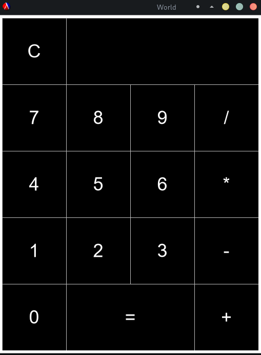
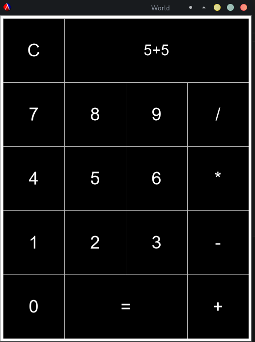
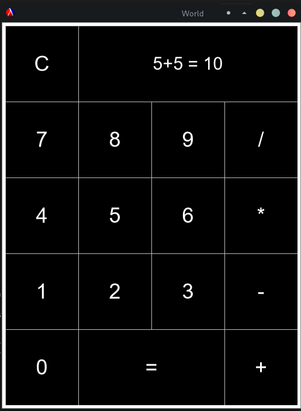
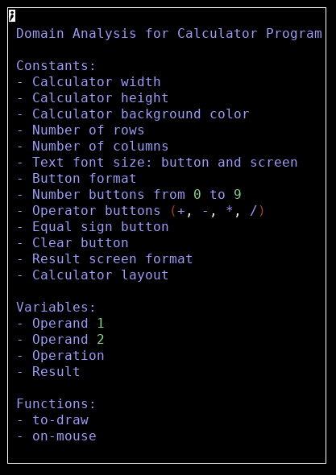
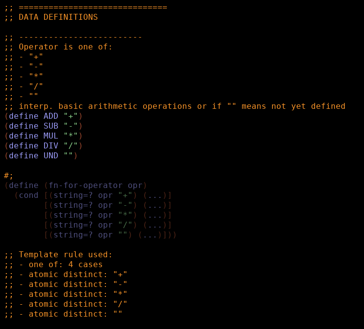
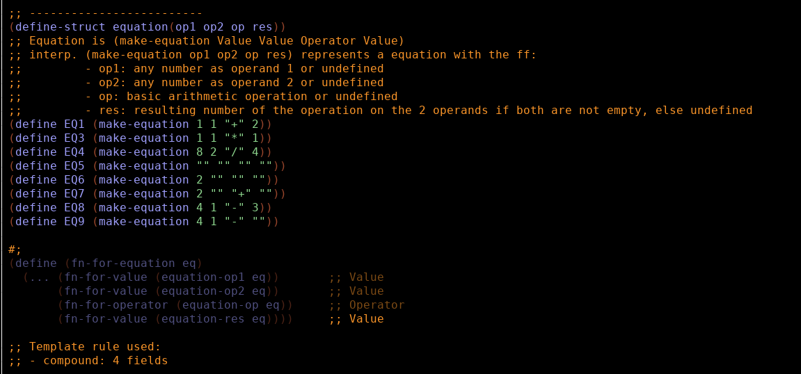
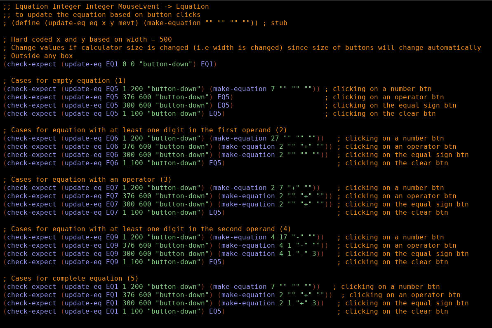
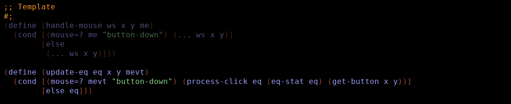
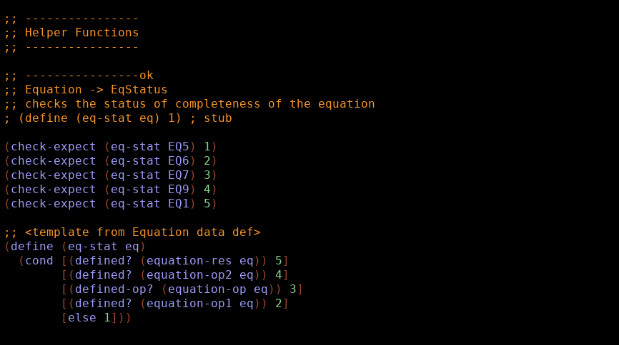
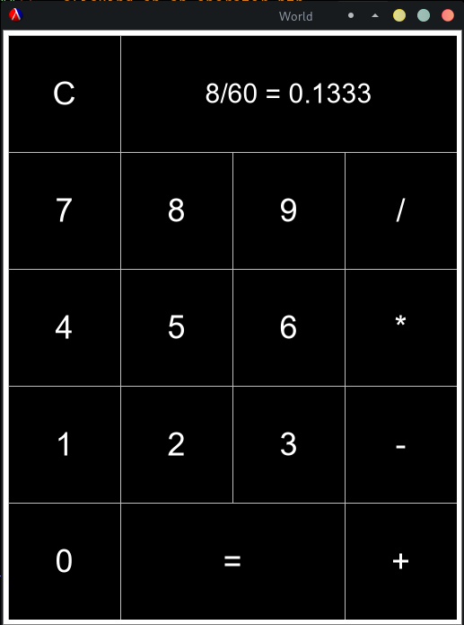

# Systematic Program Design

This repository includes all the programs I have developed using BSL (an introductory language for Lisp) while taking [Systematic Program Design](https://learning.edx.org/course/course-v1:UBCx+SPD1x+2T2015) course by UBC available from Edx.

I took this course as part of [OSSU curriculum for Computer Science](https://github.com/ossu/computer-science).

## Projects Created:

### 1. Simple Calculator

Created the project to showcase understanding of function design, data design (including using compound data), world design. This covered the lessons learned from 1a BSL to 3b Compound Data  

**Designed world**

To create the world, I first conducted domain analysis which resulted to a list of constants, variables, and UI functions to use.

**Designed data**

Based on the domain analysis, I designed the data that will represent real-world entities in the program. This includes operators and values. This is to make the data well-defined within the program and to provide the template for functions that uses these data types for a data-driven design.

**Used compound data**

For this project, I created 2 compound data:
- Equation - represents an equation with 2 operands, 1 operator and the result of operation
- Boundaries - represents button outline boundaries which is necessary for checking what buttons were clicked

**Designed function**

To design the functions, I first laid out the purpose and stub. And then I listed enough examples that covers usual case, edge cases, and corner cases. These examples were also used to create testing for the functions.

Aside from the big-bang functions to control the user interface, I have also created helper functions to break down tasks into independent manageable chunks, to follow the best practice that functions should only do one thing.

**Limitations**

- Does not support decimal input. Workaround is to use division and addition to get the desired decimal value.

